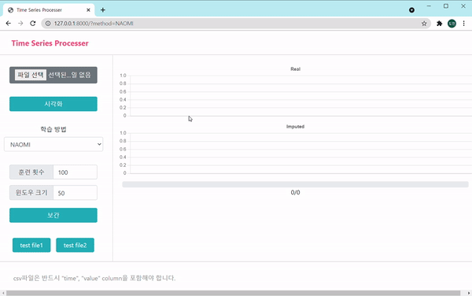
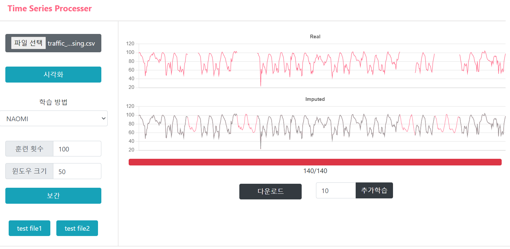
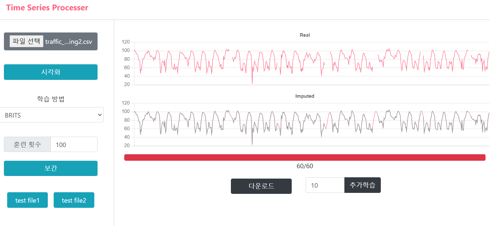

## Time Series Imputation with Django 

**paper**

[NAOMI: Non-AutOregressive Multiresolution sequence Imputation](https://arxiv.org/pdf/1901.10946.pdf) 

[BRITS: Bidirectional Recurrent Imputation for Time Series](https://arxiv.org/pdf/1805.10572.pdf)

&nbsp;

**paper translate**

NAOMI: <https://doheon.github.io/paper-translate/pt-NAOMI-post/>

BRITS: <https://doheon.github.io/paper-translate/pt-brits-post/>


위의 논문을 코드로 구현해서 시계열 데이터를 보간해주는 장고 웹 어플리 케이션을 제작했다.

chart.js를 사용하여 보간되는 결과를 실시간으로 확인할 수 있도록 했으며, 원하는 만큼 훈련을 시킬 수 있도록 UI를 설정하였다.


```
pip install -r requirement.txt
python manage.py runserver
```


**실행 화면**




**실행 결과**






